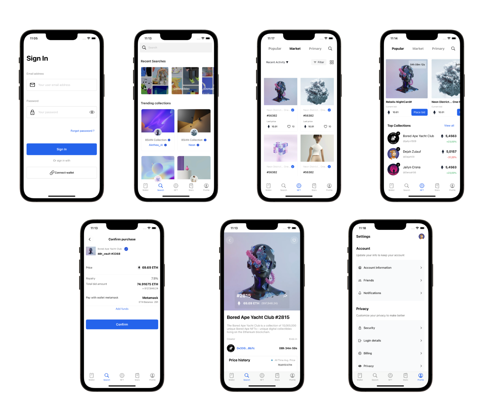

# Markets- Templates

## Description

Market is a ready-to-use template iOS App lets you quickly launch your own NFT Marketplace, providing an immersive experience for artists, collectors, and digital art enthusiasts. It is built by using  **UIKit** with **MVVM** architecture and **Combine**!

## Screens

- ✅ Onboarding with Full Authentication
- ✅ Wallet handling
- ✅ Search tab with search items simulation
- ✅ NFT MarketPlace
- ✅ Profile details (account, notifications, security, billing, logout)

## Preview

## Tech Stack

- Swift
- UIKit
- Combine

## Requirements

- iOS 13 or later
- Compatible with only iPhone

## License

Released under the MIT License. Feel free to use, modify, and distribute this project according to the terms of the license.